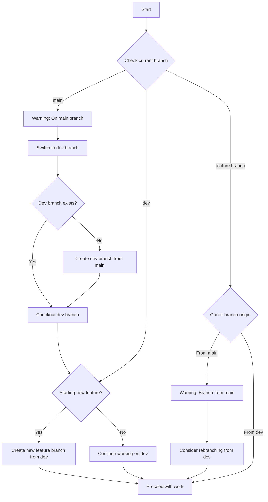

# 2025-04-05 13:48 Agent Thoughts Recap

Author: Roo Code

## 📝 Summary

This document is a detailed recap of the user's request, my interpretation and findings, and recommendations for next steps.

A comprehensive workflow design to ensure all work branches come from dev instead of main, including enhanced Git aliases and functions to enforce this pattern automatically.

## 💬 User Request

Create a workflow that ensures:

1. We're not working on main
2. We're at least on a dev branch, which may diverge from main
3. Feature work always branches from dev

## 🧠 Agent Interpretation and Findings

### Analysis of Current Setup

- **Current Limitations:** The current branch workflow in `.cursor/rules/drafts/version-control.md` focuses primarily on preventing direct work on `main`, but doesn't strongly enforce the pattern of branching from `dev`.
- **Existing Functionality:** The existing `branch-check` alias in `.git/config` is robust but similarly focuses on comparing against `main` rather than emphasizing the `dev` → feature branch workflow.

### Workflow Diagram



### Technical Implementation Plan

- **Workflow Components:**
  - Enhanced Branch Check Function: Checks against both `main` and `dev`
  - Pre-Branch Creation Check: Ensures new branches are created from `dev`
  - Dev Branch Sync Status: Checks how `dev` differs from `main`
  - Workflow Automation Script: Automates the entire workflow

### Enhanced Branch Check Function

```bash
branch-check-enhanced = "!f() { \
  CURRENT_BRANCH=$(git rev-parse --abbrev-ref HEAD); \
  DEV_BRANCH=\"dev\"; \
  MAIN_BRANCH=\"main\"; \
  
  # Get commit hashes
  CURRENT_COMMIT=$(git rev-parse HEAD); \
  MAIN_COMMIT=$(git rev-parse $MAIN_BRANCH 2>/dev/null || git rev-parse master 2>/dev/null); \
  DEV_COMMIT=$(git rev-parse $DEV_BRANCH 2>/dev/null || echo \"notfound\"); \
  
  echo \"=== BRANCH STATUS CHECK ===\"; \
  echo \"Current branch: $CURRENT_BRANCH\"; \
  
  # Check branch state and provide guidance
  if [ \"$CURRENT_BRANCH\" = \"$MAIN_BRANCH\" ]; then \
    echo \"\n⚠️ Warning: You are on $MAIN_BRANCH. Switch to dev or create a feature branch from dev.\"; \
    echo \"Suggested actions:\"; \
    if [ \"$DEV_COMMIT\" = \"notfound\" ]; then \
      echo \"  git checkout -b $DEV_BRANCH $MAIN_BRANCH  # Create dev branch\"; \
      echo \"  git checkout -b feature/$1 $DEV_BRANCH  # Then create feature branch\"; \
    else \
      echo \"  git checkout $DEV_BRANCH  # Switch to dev branch\"; \
      echo \"  git checkout -b feature/$1 $DEV_BRANCH  # Create feature branch from dev\"; \
    fi; \
  elif [ \"$CURRENT_BRANCH\" = \"$DEV_BRANCH\" ]; then \
    if [ ! -z \"$1\" ]; then \
      echo \"\n🆕 Creating new feature branch from dev: feature/$1\"; \
      git checkout -b \"feature/$1\"; \
    else \
      echo \"\n🛠️ You are on dev branch. Consider creating a feature branch for your work.\"; \
      echo \"Suggested action:\"; \
      echo \"  git checkout -b feature/your-feature-name\"; \
    fi; \
  else \
    # Check if branch was created from dev
    MERGE_BASE=$(git merge-base $CURRENT_BRANCH $DEV_BRANCH 2>/dev/null); \
    BRANCH_POINT=$(git reflog show --no-abbrev $CURRENT_BRANCH | grep -m1 -oP \"from .{0,8}\" | cut -d' ' -f2); \
    
    if [ \"$MERGE_BASE\" = \"$DEV_COMMIT\" ] || [ \"$BRANCH_POINT\" = \"$DEV_BRANCH\" ]; then \
      echo \"\n✅ You are on feature branch created from dev. Good to proceed.\"; \
    else \
      echo \"\n⚠️ This branch may not have been created from dev.\"; \
      echo \"Consider creating a new branch from dev for your changes.\"; \
      echo \"Suggested action:\"; \
      echo \"  git checkout $DEV_BRANCH\"; \
      echo \"  git checkout -b feature/$(echo $CURRENT_BRANCH | sed 's/.*\\///')-from-dev\"; \
    fi; \
  fi; \
  
  # Show dev/main relationship if both exist
  if [ \"$DEV_COMMIT\" != \"notfound\" ]; then \
    echo \"\n=== DEV/MAIN RELATIONSHIP ===\"; \
    BEHIND_AHEAD=$(git rev-list --left-right --count $MAIN_BRANCH...$DEV_BRANCH 2>/dev/null); \
    if [ $? -eq 0 ]; then \
      MAIN_AHEAD=$(echo \"$BEHIND_AHEAD\" | awk '{print $1}'); \
      DEV_AHEAD=$(echo \"$BEHIND_AHEAD\" | awk '{print $2}'); \
      echo \"dev is $DEV_AHEAD commit(s) ahead and $MAIN_AHEAD commit(s) behind main.\"; \
      if [ \"$MAIN_AHEAD\" -gt 0 ]; then \
        echo \"\n⚠️ Consider updating dev with latest changes from main:\"; \
        echo \"  git checkout dev && git merge main\"; \
      fi; \
    fi; \
  fi; \
}; f"
```

### Create Branch from Dev Function

```bash
create-branch-from-dev = "!f() { \
  if [ -z \"$1\" ]; then \
    echo \"Usage: git create-branch-from-dev <branch-name>\"; \
    return 1; \
  fi; \
  
  CURRENT_BRANCH=$(git rev-parse --abbrev-ref HEAD); \
  DEV_BRANCH=\"dev\"; \
  
  # Check if dev branch exists
  git rev-parse --verify $DEV_BRANCH >/dev/null 2>&1; \
  if [ $? -ne 0 ]; then \
    echo \"Dev branch doesn't exist. Creating dev branch from main...\"; \
    git checkout -b $DEV_BRANCH main; \
  fi; \
  
  # If not already on dev, checkout dev
  if [ \"$CURRENT_BRANCH\" != \"$DEV_BRANCH\" ]; then \
    echo \"Switching to dev branch...\"; \
    git checkout $DEV_BRANCH; \
  fi; \
  
  # Create new branch from dev
  echo \"Creating new branch '$1' from dev...\"; \
  git checkout -b \"$1\"; \
  echo \"✅ Now on branch '$1' created from dev\"; \
}; f"
```

### Dev Sync Status Function

```bash
dev-sync-status = "!f() { \
  DEV_BRANCH=\"dev\"; \
  MAIN_BRANCH=\"main\"; \
  
  # Check if dev branch exists
  git rev-parse --verify $DEV_BRANCH >/dev/null 2>&1; \
  if [ $? -ne 0 ]; then \
    echo \"⚠️ Dev branch doesn't exist.\"; \
    echo \"Suggested action:\"; \
    echo \"  git checkout -b $DEV_BRANCH $MAIN_BRANCH  # Create dev branch\"; \
    return 1; \
  fi; \
  
  # Show relationship between dev and main
  echo \"=== DEV/MAIN SYNC STATUS ===\"; \
  BEHIND_AHEAD=$(git rev-list --left-right --count $MAIN_BRANCH...$DEV_BRANCH); \
  MAIN_AHEAD=$(echo \"$BEHIND_AHEAD\" | awk '{print $1}'); \
  DEV_AHEAD=$(echo \"$BEHIND_AHEAD\" | awk '{print $2}'); \
  
  echo \"dev is $DEV_AHEAD commit(s) ahead and $MAIN_AHEAD commit(s) behind main.\"; \
  
  if [ \"$MAIN_AHEAD\" -gt 0 ]; then \
    echo \"\n⚠️ dev is behind main. Consider updating dev:\"; \
    echo \"  git checkout dev && git merge main\"; \
    
    echo \"\n=== COMMITS IN MAIN NOT IN DEV ===\"; \
    git log --oneline $DEV_BRANCH..$MAIN_BRANCH; \
  else \
    echo \"\n✅ dev is up-to-date with main.\"; \
  fi; \
  
  if [ \"$DEV_AHEAD\" -gt 0 ]; then \
    echo \"\n=== COMMITS IN DEV NOT IN MAIN ===\"; \
    git log --oneline $MAIN_BRANCH..$DEV_BRANCH; \
  fi; \
}; f"
```

### Workflow Helper Script

```bash
dev-workflow = "!f() { \
  CURRENT_BRANCH=$(git rev-parse --abbrev-ref HEAD); \
  DEV_BRANCH=\"dev\"; \
  MAIN_BRANCH=\"main\"; \
  
  echo \"=== DEV WORKFLOW HELPER ===\"; \
  
  if [ \"$CURRENT_BRANCH\" = \"$MAIN_BRANCH\" ]; then \
    echo \"⚠️ You are on $MAIN_BRANCH. Let's fix that.\"; \
    
    # Check if dev exists
    git rev-parse --verify $DEV_BRANCH >/dev/null 2>&1; \
    if [ $? -ne 0 ]; then \
      echo \"Creating dev branch from main...\"; \
      git checkout -b $DEV_BRANCH; \
      echo \"✅ Created and switched to dev branch.\"; \
    else \
      echo \"Switching to dev branch...\"; \
      git checkout $DEV_BRANCH; \
      echo \"✅ Switched to dev branch.\"; \
    fi; \
    
    if [ ! -z \"$1\" ]; then \
      echo \"Creating feature branch '$1' from dev...\"; \
      git checkout -b \"$1\"; \
      echo \"✅ Created and switched to feature branch '$1'.\"; \
    else \
      echo \"Would you like to create a feature branch? Use:\"; \
      echo \"  git dev-workflow <feature-branch-name>\"; \
    fi; \
  elif [ \"$CURRENT_BRANCH\" = \"$DEV_BRANCH\" ]; then \
    if [ ! -z \"$1\" ]; then \
      echo \"Creating feature branch '$1' from dev...\"; \
      git checkout -b \"$1\"; \
      echo \"✅ Created and switched to feature branch '$1'.\"; \
    else \
      echo \"You're on dev branch. Good start!\"; \
      echo \"Would you like to create a feature branch? Use:\"; \
      echo \"  git dev-workflow <feature-branch-name>\"; \
    fi; \
  else \
    echo \"You're on branch '$CURRENT_BRANCH'.\"; \
    
    # Try to determine if branch was created from dev
    MERGE_BASE=$(git merge-base $CURRENT_BRANCH $DEV_BRANCH 2>/dev/null); \
    DEV_COMMIT=$(git rev-parse $DEV_BRANCH 2>/dev/null); \
    
    if [ \"$MERGE_BASE\" = \"$DEV_COMMIT\" ]; then \
      echo \"✅ This branch appears to be created from dev. Good to go!\"; \
    else \
      echo \"⚠️ This branch may not have been created from dev.\"; \
      
      if [ ! -z \"$1\" ]; then \
        echo \"Would you like to recreate from dev? Run:\"; \
        echo \"  git checkout $DEV_BRANCH && git checkout -b $1\"; \
      fi; \
    fi; \
  fi; \
  
  # Show dev/main relationship
  git dev-sync-status 2>/dev/null; \
}; f"
```

## ⏭️ Recommended Next Steps

1. Update `.git/config`
   - Add the new aliases to the `.git/config` file
   - Test each function to ensure it works as expected
2. Update `.cursor/rules/drafts/version-control.md`
   - Add a new section about the dev branch workflow
   - Update existing rules to emphasize branching from dev, not main
   - Include examples using the new aliases
3. Create Documentation
   - Document the new workflow for the team
   - Include examples and common scenarios
4. User Education
   - Create a quick reference guide for the dev branch workflow
   - Highlight benefits of this approach

## 📝 Additional Notes

This implementation provides several key benefits:

- **Clear Separation:** Maintains a clear separation between stable code (main) and development code (dev)
- **Consistent Starting Point:** All feature branches have a consistent starting point
- **Merge Simplification:** Makes merging feature branches easier as they all share a common ancestor
- **Automated Safety:** The enhanced tooling prevents accidental work on main
- **Better Visibility:** Shows the relationship between dev and main at all times

## 🔄 Comparative Analysis with Cursor's Approach

After reviewing Cursor's implementation from July 2023, this approach offers several valuable enhancements:

### Key Improvements

1. **Modular Function Design:** Instead of a single monolithic alias, this implementation breaks functionality into specialized, focused functions:
   - `branch-check-enhanced`: For branch status checking
   - `create-branch-from-dev`: Dedicated to branch creation
   - `dev-sync-status`: Focused on branch relationship visualization
   - `dev-workflow`: A comprehensive workflow helper

2. **Visual Workflow Diagram:** The mermaid diagram provides a clear visual representation of the decision tree, making it easier to understand the workflow.

3. **Enhanced Branch Origin Detection:** Uses Git's `merge-base` command to more accurately determine if a branch was created from dev, rather than relying solely on branch names.

4. **Detailed Commit Visibility:** The `dev-sync-status` function shows specific commits that differ between main and dev, providing greater context for merging decisions.

5. **Proactive Sync Recommendations:** Provides explicit recommendations when dev falls behind main, helping to maintain synchronization between branches.

6. **Comprehensive Workflow Automation:** The `dev-workflow` function provides an end-to-end solution that guides users through the entire workflow rather than just specific tasks.

### Implementation Considerations

When combining the best of both approaches, consider:

1. Adopting the modular function structure while maintaining the simplicity of Cursor's implementation
2. Incorporating the visual diagram into documentation
3. Using the enhanced branch origin detection for more accurate guidance
4. Implementing detailed commit visibility for better context
5. Creating a unified workflow command that leverages the strengths of both approaches

The complementary strengths of these implementations could provide a robust, user-friendly solution that effectively enforces the dev branch workflow while providing helpful guidance throughout the process.
